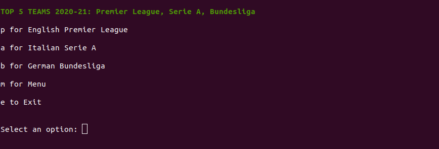

## About
Scraper program that works in the terminal to fetch and display a list of top five positions from three of the most popular football leagues in Europe. Built with Ruby, Nokogiri, and Rubocop.
 

# Web Scraper: Europe's Football Leagues
 
> In this project I created a web scraper program to parse HTML documents.
The websites that are used for the project are:
- [Premier League](https://www.espn.com/soccer/table/_/league/eng.1)
- [Serie A](https://www.espn.com/soccer/table/_/league/ita.1)
- [Bundesliga](https://www.espn.com/soccer/table/_/league/ger.1)
> The final output is a list of five teams (based on the specified league from the given menu), the total points of each team, and at the end, the specific URL from where the data is taken.
- Runs on the terminal/command line.
- The 'main_scraper' file is executable.
 
## Examples

 
## Built With
- Ruby (v. 2.7.0)
- Rubocop
- Git
- RSpec
- Nokogiri gem (v. 1.10.10)
- Colorize gem
 
## Setup
For installing Nokogiri / RSpec:
From the project's root directory, execute 'bundle' to install Nokogiri and RSpec:
- Type: 'bundle install'
For installing colorize gem:
On the command line/terminal:
- Type: 'gem install colorize'
 
## How to run it
To get a local copy up and running follow these simple steps:
* It's recommended to use Git's latest version.
* Clone or download the repo from here [soccer-leagues-scraper](https://github.com/Milypm/soccer-leagues-scraper.git) on your local system.
* Unzip/Open the root folder, on the command line/terminal:
- Type: main_scraper
- The program (scraper) should display now on the terminal.
 
## Testing with RSpec
- Verify that you have RSpec installed: go to the Terminal/Command line and type: 'rspec -v' or 'rspec --version'.
- To install Rspec: go to the Terminal/Command line and type: 'gem install rspec', you can now verify the version installed with 'rspec -v' or 'rspec --version'.
- Open the root directory for this repository ('soccer-leagues-scraper'):
   Type: rspec
 
## Authors
**Mily Puente** :woman_technologist:
- GitHub: [@Milypm](https://github.com/Milypm)
- LinkedIn: [Mily Puente](https://www.linkedin.com/in/milypuentem/)
 
## Contribute :point_left:
Any advice and suggestion for improvement are more than welcome.
Visit [issues' section](https://github.com/Milypm/soccer-leagues-scraper/issues)

## Show your support
Give a :star2: if you like this project!

## License
This project is [MIT](https://github.com/Milypm/soccer-leagues-scraper/blob/main/LICENSE) licensed.
